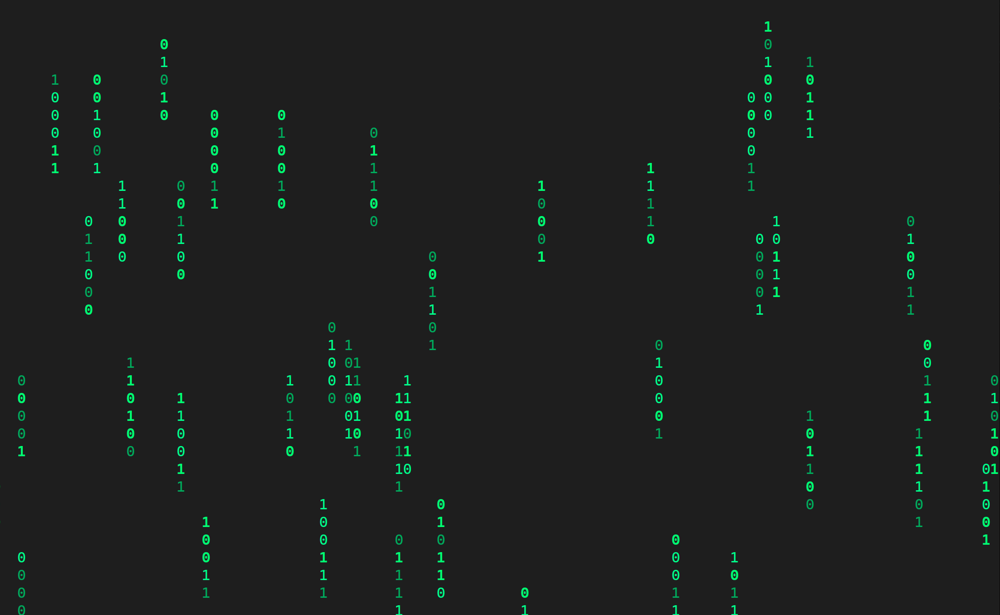

# Matrix Rain

## Table of Contents

- **[Overview](#overview)**
- **[Control Settings](#control-settings)**
- **[How to run?](#how-to-run)**
- **[Screenshots](#screenshots)**

## Overview

Matrix Rain is a terminal-based simulation inspired by the iconic "Matrix" digital rain effect. The application creates the visual effect of falling rain columns of characters in the terminal.

## Control Settings

- `q` - Quit the application.
- `c` - Cycle through the color schemes for the rain effect.

## How to run?

### Requirements

- `Python 3.x`
- `keyboard` library
- `iridis` library
- `numpy` library

#### Install Dependencies

You can install the necessary libraries using the following commands:

*Note: The keyboard library requires sudo permissions on linux so please install all required libraries with sudo mode.*

```bash
pip install keyboard numpy iridis
```

**To run the application**, simply execute this in the terminal:

*Note: The keyboard library requires sudo permissions on linux so run the app as sudo.*

```bash
python matrix_rain.py
```

## Screenshots

*Note: Below is an example of how the application looks when running in the terminal.*


*Green*


*Red*


*Blue*
